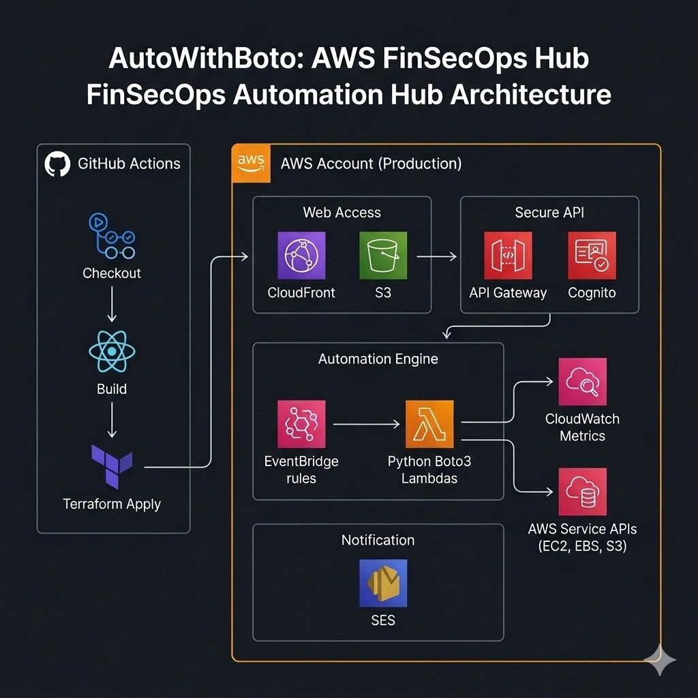

# 🚀 AutoWithBoto: AWS FinSecOps Automation Hub

 


**AutoWithBoto** is a cutting-edge **FinOps** (Cloud Cost Optimization) and **SecOps** (Security Operations) automation platform. It empowers cloud engineers to identify, analyze, and remediate idle or insecure AWS resources in minutes, not hours.

---

## 🎨 System Architecture



The platform follows a **Serverless-First** architecture designed for low latency, tight security, and high scalability.
- **Frontend**: React-based dashboard served via S3 + CloudFront.
- **Security**: AWS Cognito Handles Authentication, API Gateway manages the REST interface.
- **Execution**: Python (Boto3) Lambdas execute complex resource audits and remediation logic.
- **Automation**: EventBridge triggers scheduled scans (Daily/Hourly) with SES/SNS notifications.

---

## 💎 Core Features

### 💰 FinOps: Cost Optimization
- **Idle EC2 Detection**: Scans CloudWatch CPU utilization metrics to identify instances that are paid for but not used.
- **Unattached EBS Cleanup**: Locates "Available" volumes that are no longer attached to any instances.
- **One-Click Remediation**: Stop or Delete resources directly from the dashboard.

### 🛡️ SecOps: Security Hardening
- **S3 Public Access Scan**: Audits bucket policies and Public Access Blocks to prevent data leaks.
- **Security Group Audit**: Identifies open ports (e.g., 22/3389) that expose your network.
- **Automated Lockdown**: Secure your infrastructure with one click using pre-validated remediation scripts.

---

## ⚙️ Initial Setup & Deployment

The platform is designed for **Automated Deployment** using Python orchestration scripts.

> [!IMPORTANT]  
> Before the main deployment, you **MUST** run the bootstrap script to initialize the Terraform remote backend (S3 Bucket + DynamoDB Table).

### 1. Bootstrap Phase
This step creates the infrastructure required to host the Terraform state securely.
```powershell
cd terraform/bootstrap
terraform init
terraform apply
```

### 2. Full Automated Deployment
Once bootstrapping is complete, a single command handles lambda packaging, infrastructure provisioning, environment configuration, and frontend deployment.
```powershell
# From the project root
python scripts/deploy.py
```
*This script automates packaging, `terraform apply`, `.env` generation for React, and `s3 sync`.*

---

## 🛠️ Infrastructure Management

To tear down the environment safely (excluding user-generated EventBridge rules):
```powershell
python scripts/destroy.py
```

---

## 🏢 Scaling to Multi-Account Architecture

Want to scan your entire organization? **AutoWithBoto** is built to scale using a **Hub-and-Spoke** model.

### The Problem
By default, the Lambda role only has permissions within its own account. To scan multiple accounts, we use **IAM Role Assumption**.

### Step-by-Step Implementation:
1. **Target Account Role**: Create an IAM role (e.g., `FinSecOpsScannerRole`) in all target accounts with the necessary `ReadOnlyAccess` or custom permissions.
2. **Trust Relationship**: Allow the **Hub Account's Lambda Role** to assume this role.
   ```json
   {
     "Version": "2012-10-17",
     "Statement": [{
       "Effect": "Allow",
       "Principal": { "AWS": "arn:aws:iam::HubAccountID:role/lambda-role" },
       "Action": "sts:AssumeRole"
     }]
   }
   ```
3. **Lambda Hub Update**: Modify `utils.py` to loop through a list of account IDs and assume the role before initializing the Boto3 client.

---

## ⚠️ Critical Warnings

> [!WARNING]  
> **Scheduling Persistence**: Any schedules (EventBridge Rules) generated dynamically via the **Dashboard** will **NOT** be destroyed. These must be manually cleaned to avoid leftover infrastructure costs.

---

## 📂 Project Structure

- `backend/lambdas/`: Serverless logic for scanning and remediation.
- `frontend/`: React components and UI hooks.
- `terraform/`: Multi-environment infrastructure defined as code.
- `scripts/`: Python and Shell utilities for packaging and deployment.

---

## ✨ Credits

- **Infrastructure as Code (IaC)**: Handled and Architected by **Houssem Rezgui**.
- **Frontend UI & Python Scripts**: Assisted by **AI Collaboration**.

**Built with ❤️ by Houssem Rezgui**
