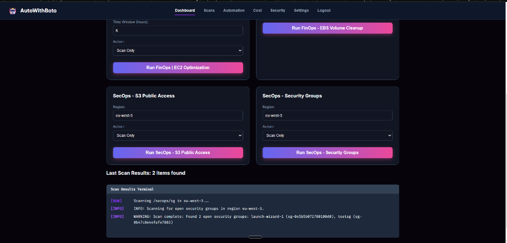
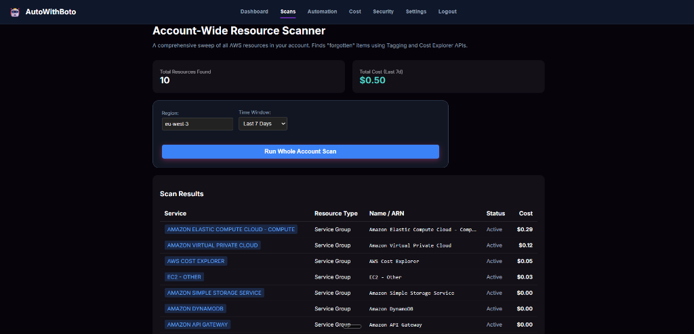
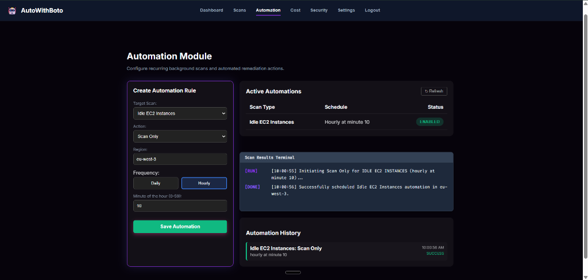

# 🚀 AutoWithBoto: AWS FinSecOps Automation Hub

 


**AutoWithBoto** is a cutting-edge **FinOps** (Cloud Cost Optimization) and **SecOps** (Security Operations) automation platform. It empowers cloud engineers to identify, analyze, and remediate idle or insecure AWS resources in minutes, not hours.

---

## 🛠️ System Architecture


The **AutoWithBoto** platform is built on a high-availability, serverless architecture that integrates a dedicated **DevOps Pipeline** for continuous delivery and a robust **EventBridge Orchestrator** for automated infrastructure management.

- **Frontend**: Single Page Application (SPA) hosted in **Amazon S3** and distributed by **CloudFront** for low-latency global delivery.
- **Security**: **Amazon Cognito** handles primary authentication and authorization for the dashboard and API.
- **Backend API**: **Amazon API Gateway** (HTTP API) interfaces with localized **Lambda Functions** (Python/Boto3).
- **Automation Heart**: **Amazon EventBridge** rules trigger periodic scans and remediations according to your defined schedules (10m, 1h, Daily).
- **Execution Engine**: Lightweight **Lambda** functions perform deep infrastructure audits against **CloudWatch Metrics** and service APIs (EC2, S3, EBS).
- **Notifications**: Alerts and success logs are dispatched via **Amazon SES** (Email) and **Amazon SNS** (Webhooks).

---

## 🚀 GitHub Actions CI/CD Pipeline

The platform is managed by a centralized GitHub Actions workflow, ensuring consistent builds and secure infrastructure deployments.

1.  **🔍 Code Quality**: Automated linting and unit tests for Python Lambdas.
2.  **📦 Build Phase**: Packaging Lambda code zip files and staging frontend assets.
3.  **⚡ Terraform Deploy**: Orchestrates the provisioning of AWS resources (IAM, EventBridge, S3) with state management.
4.  **🌐 Frontend Sync**: Synchronizes the build artifacts with the S3 bucket and perform a CloudFront invalidation for immediate updates.

---

## 🖼️ UI Showcase

Experience the power of **AutoWithBoto** through its intuitive, high-performance dashboard.

### 📊 Central Audit Dashboard
The core interface for manual execution. It allows engineers to run ad-hoc scans for EC2 optimization, EBS cleanup, and security hardening with real-time terminal output.



### 🔍 Account-Wide Resource Scanner
A comprehensive sweep of all AWS resources, providing a high-level view of resource counts and cost distributions across the account.



### 🤖 Intelligent Automation (EventBridge)
The background engine of the platform. Using Amazon EventBridge, you can schedule recurring tasks with two distinct execution modes:



1.  **🔍 Scheduled Scanning (Dry-Run)**:  
    Monitor your infrastructure on a 10-minute, hourly, or daily basis. The system identifies issues and logs them to the history for your review without making changes.
2.  **⚡ Automated Remediation (Hands-Off)**:  
    Enable full automation to let the system handle remediation workflows. It will automatically **Stop Idle EC2** instances, **Unattach Orphaned EBS** volumes, or **Secure S3 Buckets** the moment they violate policy.

---

## 💎 Core Features

### 💰 FinOps: Cost Optimization
- **Idle EC2 Detection**: Scans CloudWatch CPU utilization metrics to identify instances that are paid for but not used.
- **Unattached EBS Cleanup**: Locates "Available" volumes that are no longer attached to any instances.
- **One-Click Remediation**: Stop or Delete resources directly from the dashboard.

### 🛡️ SecOps: Security Hardening
- **S3 Public Access Scan**: Audits bucket policies and Public Access Blocks to prevent data leaks.
- **Security Group Audit**: Identifies open ports (e.g., 22/3389) that expose your network.
- **Automated Lockdown**: Secure your infrastructure with one click using pre-validated remediation scripts.

---

## 🛡️ Safe Audit & Controlled Remediation

**AutoWithBoto** prioritizes infrastructure integrity. Every automation follows a strict two-stage security protocol:

1.  **🔍 Deep Audit (Scan-Only)**:  
    -   Perform comprehensive resource discovery without any destructive actions.
    -   Visualize findings in the central dashboard to assess potential cost savings or security risks.
    -   Perfect for "What-If" analysis and periodic reporting.

2.  **⚡ Manual Remediation (One-Click)**:  
    -   Only after you are **100% confident**, trigger the remediation action.
    -   Targeted execution: Delete unattached EBS volumes or stop idle EC2 instances only when you authorize it.
    -   Full control remains with the administrator, eliminating accidental downtime.

---

## ⚙️ Initial Setup & Deployment

The platform is designed for **Automated Deployment** using Python orchestration scripts.

> [!IMPORTANT]  
> Before the main deployment, you **MUST** run the bootstrap script to initialize the Terraform remote backend (S3 Bucket + DynamoDB Table).

### 1. Bootstrap Phase
This step creates the infrastructure required to host the Terraform state securely.
```powershell
cd terraform/bootstrap
terraform init
terraform apply
```

### 2. Full Automated Deployment
Once bootstrapping is complete, a single command handles lambda packaging, infrastructure provisioning, environment configuration, and frontend deployment.
```powershell
# From the project root
python scripts/deploy.py
```
*This script automates packaging, `terraform apply`, `.env` generation for React, and `s3 sync`.*

---

## 🛠️ Infrastructure Management

To tear down the environment safely (excluding user-generated EventBridge rules):
```powershell
python scripts/destroy.py
```

---


## ⚠️ Critical Warnings

> [!WARNING]  
> **Scheduling Persistence**: Any schedules (EventBridge Rules) generated dynamically via the **Dashboard** will **NOT** be destroyed. These must be manually cleaned to avoid leftover infrastructure costs.

---

## 📂 Project Structure

- `backend/lambdas/`: Serverless logic for scanning and remediation.
- `frontend/`: React components and UI hooks.
- `terraform/`: Multi-environment infrastructure defined as code.
- `scripts/`: Python and Shell utilities for packaging and deployment.

---

## ✨ Credits

- **Infrastructure as Code (IaC)**: Handled and Architected by **Houssem Rezgui**.
- **Frontend UI & Python Scripts**: Assisted by **AI Collaboration**.

**Built with ❤️ by Houssem Rezgui**
